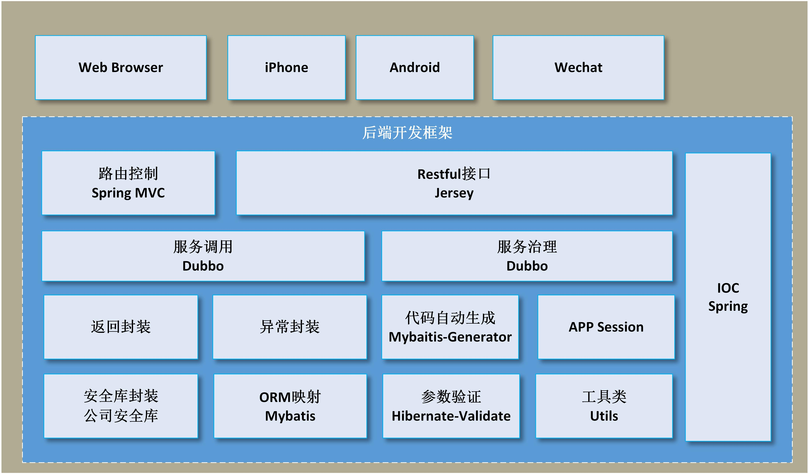

## smartcity框架介绍

### 背景
> 在搭建项目之时，需要引入依赖、配置框架，通常一些开源组件和配置不同版本之间会出现冲突问题。
> 前端的模版化引擎会统一渲染接口返回值，这就要求服务端需要对异常信息和响应结果进行统一封装。 
> 为了加快项目开发进度还需要封装一些常用的类和工具包，比如 *App Session*管理、接口签名认证、参数验证、常用类型转换等等，有了这些项目才能正常开工。 
> 然而，下次再做类似的项目上述步骤可能还要重来一遍，虽然通常是拿来copy再改改，但是还是比较浪费时间的。所以可以利用面向对象抽象的思想，抽取这类项目的共同之处封装成了种子项目，再开发类似项目时可以直接在此之上迭代，减少无意义的重复工作。

### 意义
> 框架的意义在于提高开发效率，统一开发模式，规范编码，减少重复工作，降低出错，提供必要的公共功能，同时需要易于集成、便于维护。

### 功能概览

* 预定义常用开源组件依赖版本和插件配置信息，极大的简化了maven 配置
* 拦截`Response`的返回值，自动封装成 [Result](https://upload-images.jianshu.io/upload_images/1720399-ef517a5be56903e8.png) 类型 
* 拦截`RuntimeException`异常，统一处理自动封装
* 代码自动生成，自动生成 Mybatis-mapper代码
* 简化参数校验流程
* 集中管理分布式应用的`APP Session`
* 根据 Token 认证增强 APP 接口安全性
* 利用 RedisClient 使用`Redis`缓存
* 自动执行SQL初始化脚本工具

### 开发环境
* *JDK 1.7*
* *Maven3+*
* *Oracle11g*

### 技术选型
| 分类 | 技术选型 | 描述 |
| :---: | --- | --- |
| 开发框架 | Spring 3.2.9.RELEASE | 主流的轻量级JAVA开发框架 |
| MVC框架 | SpringMVC 3.2.9.RELEASE | 优秀的的MVC框架，与Spring无缝集成 |
| Restful框架 | Jersey 2.6 | 主流的Restful框架 |
| Restful框架 | Resteasy 3.0.7.Final | 主流的Restful框架 |
| Restful Client | Httpclient 4.5.3 | HTTP 协议的客户端编程工具包 |
| ORM框架 | Mybatis 3.2.8 | 优秀的持久层框架 |
| 缓存方案 | Spring Cache 3.2.9.RELEASE | Spring带来的强大缓存技术 |
| 缓存连接 | Jedis 2.4.1 | 分布式缓存数据库Redis的Java客户端框架 |
| 数据库连接池 | Druid 1.0.5 | 阿里的数据库连接池框架 |
| 数据库驱动 | ojdbc6 11.2.0.1.0 | oracle数据库驱动 |
| Servlet引擎 | Jetty 6.1.26 | 轻量级的web服务器 servlet 引擎框架 |
| Servlet引擎 | Tomcat 7.0.57 | 最为广泛的 servlet 引擎框架 |
| 协调服务 | Zookeeper 3.4.7 | 优秀的分布式协调服务框架 |
| 服务管理 | Dubbo 2.5.3 | 阿里的分布式服务治理框架 |
| 网络编程 | Netty 3.0.7.Final | 广泛使用的Java网络编程框架 |
| 搜索引擎 | Solr 5.5.2 | 基于Lucene的独立的企业级搜索引擎 |
| 搜索引擎 | Elasticsearch | 基于Lucene的分布式多用户的全文搜索引擎 |
| 消息队列 | ActiveMQ | 最流行的，能力强劲的开源消息队列框架 |
| 作业调度 | Quartz 2.2.3| 便于与Java项目集成的任务调度框架 |
| 文件系统 | FastDFS 1.0.1 | 轻量级分布式文件系统 |
| 日志组件 | slf4j 1.6.6 | 主流的日志系统统一的接口 |
| 校验框架 | Hibernate Validator 4.2.0.Final | 主流的校验框架 |
| 数据序列化 | Gson 2.2.4 | Json数据序列化框架 |
| 测试| Juint 4.8 | 单元测试框架 |
| DOM | dom4j 1.6.1 | dom解析框架 |
| 富文本 | Ueditor 1.1.1 | 富文本编辑器框架 |

### 包含模块
* *smartcity-dependencies*
    > *parent.pom*，统一规划主要依赖开源组件和中间件版本，构建插件的版本和配置信息
    
* *smart-core*
    > 公共核心的*Core*包，定义公共的返回*Result*、异常、分页等类型以及工具类
    
* *smartcity-support*
    > 封装常用功能，提供缓存处理、*https*请求、延时消息、定时任务等已成熟的实现方案
    
* *smartcity-app-core*
    > 基于*Jersey*框架封装的*Restful*请求处理框架，实现了*APP Sessio*n管理及接口权限验证

* *smartcity-web-core*
    > 基于*SpringMVC*封装的请求处理框架，实现了*Mybatis*分页及自动执行*SQL*初始化脚本
    

### 后续计划
* 优化mybatis-generator 插件：实现批量生成和指定生成的功能
* SQL初始化功能优化：支持版本迭代识别
* 一键生成初始化项目
* 环形队列&延时任务处理
* 日志自动打印，自动归档
* 利用注解自动映射字典中文和日期格式

欢迎各路好汉一起来参与完善`smartcity`，我们期待您宝贵的建议！

