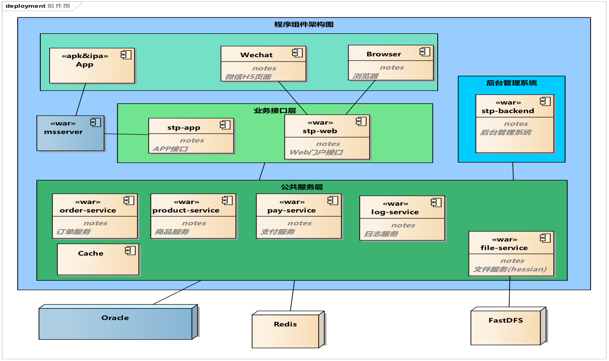
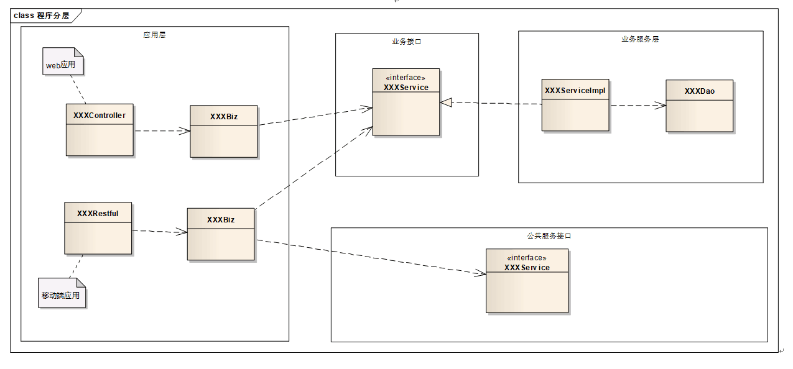

## 开发指南

### 代码结构
我们先来看看整个开发项目的代码结构，当我们拿到一个使用了这套框架的初始化项目，亦或是一个成熟的项目，<br>它大概的结构是这样的：
```
.fm-parent
|-- db-change ········································ 数据库表字段更改记录
|
|-- startup ·········································· 启动脚本，部分项目可能无
|
|-- fm-core ·········································· 项目公共jar包，公共变量及方法，小项目舍弃
|   |-- src 
|   |   |-- main
|   |   |   |-- java 
|   |   |   |   `-- 包路径             
|   |   |   |       |-- constants ···················· 公共常量目录，应用所需常量，不包含api常量             
|   |   |   |       `-- utils ························ 公用工具类目录        
|   |   |   `-- resources
|   |   `-- test
|   `-- pom.xml ······································ 构建配置信息
|
|-- fm-api ··········································· 服务层接口，dubbo-api包，提供服务层接口
|   |-- src 
|   |   |-- main
|   |   |   |-- java
|   |   |   |   `-- 包路径             
|   |   |   |       |-- constants ···················· 常量目录，api对外常量            
|   |   |   |       |-- api ·························· dubbo-api接口目录             
|   |   |   |       `-- model ························ 接口出入参数模型目录，模型一般以Dto结尾            
|   |   |   |           |-- 模块1              
|   |   |   |           `-- 模块2              
|   |   |   `-- resources
|   |   |       `-- dubbo ···························· duubo配置文件目录
|   |   |           `-- dubbo-consume-demo.xml ······· 提供给消费者的duubo接口，便于消费者集成
|   |   `-- test
|   `-- pom.xml ······································ 构建配置信息
|
|-- fm-app ··········································· 应用层，restful接口war包，提供rest请求
|   |-- src
|   |   |-- main
|   |   |   |-- java
|   |   |   |   `-- 包路径            
|   |   |   |       |-- base ························· 基本信息目录           
|   |   |   |       |   |-- config          
|   |   |   |       |   |   |-- RestConfig.java ······ jersry框架里Servlet的配置类，一般不修改          
|   |   |   |       |   |-- Config.java ·············· 利用spring-bean对配置信息的映射类           
|   |   |   |       |   `-- ReturnCode.java ·········· 异常信息的枚举           
|   |   |   |       |-- biz ·························· 应用逻辑层目录，聚合接口，格式化参数            
|   |   |   |       |-- rest ························· 应用控制层目录，接收前端参数，校验合法性            
|   |   |   |       `-- vo ··························· 前后端交互的参数模型目录，一般以Vo结尾            
|   |   |   |           |-- 模块1             
|   |   |   |           `-- 模块2 
|   |   |   |-- resources ···························· 项目资源目录
|   |   |   |   |-- config ··························· 配置文件目录            
|   |   |   |   |   |-- local ························ 本地调试配置信息目录           
|   |   |   |   |   |-- dev ·························· 开发服务器配置信息目录            
|   |   |   |   |   |-- test ························· 测试环境配置信息目录            
|   |   |   |   |   `-- prod ························· 生产环境配置信息目录            
|   |   |   |   |-- application-context.xml ·········· spring-bean的配置信息          
|   |   |   |   |-- dubbo-consumer.xml ··············· dubbo消费者的初始化配置信息            
|   |   |   |   `-- log4j.properties ················· log4j日志的配置信息           
|   |   |   `-- webapp  ······························ war包的信息配置目录
|   |   |       |-- WEB-INF
|   |   |       |   `-- web.xml ······················ web项目入口，初始化配置信息
|   |   |       `-- index.jsp ························ 项目初始化欢迎页
|   |   `-- test
|   |-- jetty.xml ···································· jetty描述文件，一般不做修改 
|   |-- pom.xml ······································ 项目构建配置信息
|   `-- readMe.txt ··································· 部署说明，注意事项
|
|-- fm-backend ······································· 应用层，项目后台管理系统war包
|   |-- src
|   |   |-- main
|   |   |   |-- java
|   |   |   |   `-- 包路径             
|   |   |   |       |-- base ························· 基本信息目录 
|   |   |   |       |   |-- Config.java ·············· 利用spring-bean对配置信息的映射类           
|   |   |   |       |   `-- ReturnCode.java ·········· 异常信息的枚举           
|   |   |   |       |-- biz ·························· 应用逻辑层目录，聚合接口，格式化参数            
|   |   |   |       |-- controller ··················· 应用控制层目录，接收前端参数，校验合法性           
|   |   |   |       |-- filter ······················· 过滤器目录            
|   |   |   |       |   `-- LoginFilter.java ········· 登陆过滤器，管理登陆时的session信息         
|   |   |   |       `-- vo ··························· 前后端交互的参数模型目录，一般以Vo结尾           
|   |   |   |           |-- 模块1              
|   |   |   |           `-- 模块2 
|   |   |   |-- resources ···························· 资源目录，同上，不再详细说明
|   |   |   |   |-- config             
|   |   |   |   |   |-- local            
|   |   |   |   |   |-- dev            
|   |   |   |   |   |-- test             
|   |   |   |   |   `-- prod             
|   |   |   |   |-- application-context.xml            
|   |   |   |   |-- dubbo-consumer.xml             
|   |   |   |   `-- log4j.properties             
|   |   |   `-- webapp
|   |   |       |-- resources ························ 前端静态资源目录
|   |   |       |-- views ···························· jsp文件目录
|   |   |       |   |-- 模块1
|   |   |       |   |-- 模块2
|   |   |       |   `-- error ························ 异常请求jsp文件目录
|   |   |       |-- WEB-INF  ························· war包的信息配置目录
|   |   |       |   `-- web.xml ······················ web项目入口，初始化配置信息
|   |   |       `-- index.jsp ························ 初始化欢迎页jsp
|   |   `-- test
|   |-- jetty.xml ···································· jetty描述文件，一般不做修改 
|   |-- jetty-env.xml ································ jetty的配置文件，一般配置数据库连接信息
|   |-- pom.xml ······································ 构建配置信息
|   `-- readMe.txt ··································· 部署说明，注意事项
|
|-- fm-web ··········································· 应用层，项目web门户系统war包，类同backend
|
`-- fm-service ······································· 业务层，dubbo-service包，实现api接口
    |-- src
    |   |-- assembly ································· 打包配置目录
    |   |   |-- bin ·································· 启动脚本目录
    |   |   |   |-- run.bat ·························· windows环境启动脚本
    |   |   |   |-- run.sh ··························· linux环境启动脚本 
    |   |   `-- assembly.xml ························· service打包配置信息，一般不做修改
    |   |-- main
    |   |   |-- java
    |   |   |   `-- 包路径             
    |   |   |       |-- base ························· 基本信息目录
    |   |   |       |   |-- Config.java ·············· 利用spring-bean对配置信息的映射类          
    |   |   |       |   |-- Constants.java ··········· 常量类，提供本子项目所需使用的常量           
    |   |   |       |   `-- ReturnCode.java ·········· 异常信息的枚举          
    |   |   |       |-- dao ·························· 业务持久化层，调用sql，操作数据库     
    |   |   |       |-- entity ······················· 数据库表对应映射的实体类     
    |   |   |       |-- service ······················ 业务实现层，api接口的实现
    |   |   |       |-- InitApplication.java ········· 应用初始化类，在容器初始化后调用            
    |   |   |       |-- Provider.java ················ dubbo的启动类，运行main方法启动项目         
    |   |   `-- resources
    |   |       |-- config ··························· 配置文件目录
    |   |       |   |-- local             
    |   |       |   |-- dev             
    |   |       |   |-- test             
    |   |       |   `-- prod 
    |   |       |-- mapper ··························· Mybatis映射的xml文件目录  
    |   |       |-- META-INF ························· jar包的信息配置目录
    |   |       |   `-- spring ······················· spring配置信息目录
    |   |       |       |-- dubbo-provider.xml ······· spring-bean的配置信息
    |   |       |       `-- spring-context.xml ······· duubo提供者的初始化配置信息
    |   |       |-- sql ······························ 初始化sql存放目录
    |   |       |   |-- initTabel.xml ················ 初始化表结构sql
    |   |       |   `-- initDate.xml ················· 初始化表数据sql
    |   |       |-- log4j.xml ························ log4j日志的配置信息
    |   |       |-- generatorConfig.xml ·············· mybatis反向生成代码配置文件
    |   |       |-- mybatis-generator.properties ····· mybatis反向生成代码配置信息
    |   |       `-- mybatis-config.xml ··············· mybatis配置信息
    |   `-- test
    |-- pom.xml ······································ 构建配置信息
    `-- readMe.txt ··································· 部署说明，注意事项
```
### 设计思想
* 考虑到现在的移动互联网时代系统往往是多端应用（移动端、wx端、web门户、后台管理），但是各应用运行的网络环境可能不同（互联网，内网、专线网络），每端应用单独成立一个web系统。
* 多端应用同属一个系统，业务可能类似比较高，避免重复业务带来重复代码加大维护成本，我们用一套业务处理系统来实现具体业务，以供各端应用在不同场景下使用，因此业务的接口需要具备通用性，可供多端应用使用，这对各位的设计能力来讲是一个考验（如何设计得通用且易于拓展）。
* 多端应用公用一套业务层系统会带来并发压力，考虑到性能、伸缩性、可用性和与spring框架结合的使用成本，我们选择阿里的开源服务框架dubbo来解决这些问题，由dubbo-api提供对外的业务接口，由dubbo-service来实现具体业务。`ps：对于dubbo框架不了解的同学可以学习 http://dubbo.wangxingrong.com/User+Guide-zh.htm`
* 这个时候有些同学不禁会疑惑，业务都有service处理了，应用中的biz层是做什么的呢？<br>
    > 我们有很多分布式应用，各个应用之间会有业务关联和调用，biz层的一个主要作用是把它们聚合起来，封装成适用于前端显示的业务接口；它还有一个重要作用就是对数据的格式化处理，以满足各端应用对数据不同的表现形式。

    
### 程序分层
* Controller/Restful（应用层）：接受前台请求和参数并返回，前台参数校验。
* Biz（应用层）：调用各类服务（Service），组装数据并格式化。
* Service（业务层）：调用各个数据库表数据（Dao），实现业务。
* Dao（业务层）：调用SQL，操作数据库。


### 开发规范
* 安装**Alibaba Java Code Guidelines**插件，检查代码规范性，严格注意几点：
    + 不允许任何魔法值（即硬编码）直接出现在代码中。
    + 类名必须写上`@author`和`@date`。
    + 方法注释要清晰正确，包含`param`和`return`。
* 命名规范：
    + Java类名、局域变量、类变量名、方法名采用标准驼峰命名，切勿出现单词拼写错误。
    + 常量命名由大写字母与下划线组成，禁止简写。
    + 数据库表名、字段名由小写字母加下划线组成。最多长度30个字母，允许适当使用简写。
    + 除 java文件以外的其他类型文件，包括xml、jsp、properties等由小写字母和横线组成。
* 代码提交规范：
    + **切记**避免提交不该提交的代码，例如构建生成的文件（.iml、.classpath等）。
    + **必须写备注**，清晰规范并能正确描述所提交内容。
* **pom.xml**中版本依赖定义规范：
    + 在parent项目`pom.xml`中使用`dependencyManagement`预定义整个项目所需的内部、外部依赖和配置信息，当项目升级时及时添加、更改。
    + 属性值统一定义在`properties`中，便于集中维护。
* **GET/POST**请求使用规范：
    + 搜索、查询、详情、显示等使用`get`。
    + 提交、更新、删除等使用`post`。
* 数据模型定义规范：
    + api接口层的数据模型，它是对外提供服务接口，为保护数据库数据结构，数据模型不可直接使用数据库映射的实体。
    + api接口层数据模型的作用是应用层与服务层之间传递数据的对象，命名应以Dto`（Data Transfer Object）`结尾。
    + 由于dubbo通常传输数据是二进制数据，也就是说你传递对象时，这个对象将会被序列化为二进制数据，所以你传递的对象一定要**实现Serializable接口**`（可安装GenerateSerialVersionUID插件自动生成serialVersionUID）`，否则dubbo消费者调用会出错。
    + 应用层里的数据模型，它的作用是把某个指定页面的所有数据封装起来，因此把它定义为视图对象，命名应以Vo`（View Object）`结尾。
    + 有些同学不禁会疑惑，在实际业务中我们只是简单的查询，为什么要定义这么多模型对象？用一个例子来说明可能会比较容易理解：
        > 服务层有一个getUser的方法返回一个系统用户，其中有一个属性是gender`（性别）`，对于服务层来说，它只从语义上定义：1-男性，2-女性，0-未指定。<br>而接口服务同时给多个应用端使用，不同的应用对于表现层的要求有所不同（app应用显示 1-帅哥，2-美女，0-未知；web门户应用显示1-男性，2-女性，0-未指定），就会出现问题了。<br>再者，回到设计层面上分析，从职责单一原则来看，服务层只负责业务（返回 1，2，0）与具体的表现形式无关，因此它返回的数据不应该出现与表现形式的耦合。
* 异常处理规范：
    + 框架已对常见的Http异常进行了识别、处理和封装，无需再重复处理。
    + 我们需专注于业务产生的异常，及时抛出**BusinessException**。
    + 对可预见的`RuntimeException`异常以及RPC异常需用日志记录，以便于线上问题追踪。
* 参数合法性检查规范：
    + 在应用控制层进行前端入参合法性校验，避免异常参数流向下一层造成业务异常，甚至**事务无法回滚**问题。
    + dubbo-api是提供给自身应用以及其他业务使用的对外接口，考虑到安全性和通用性，需在接口处（已融合Hibernate-validate框架，使用注解）做参数校验。


