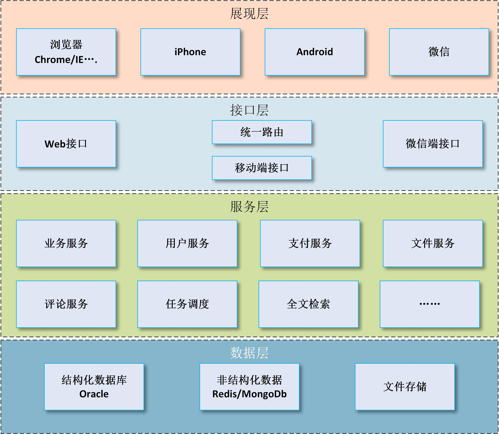
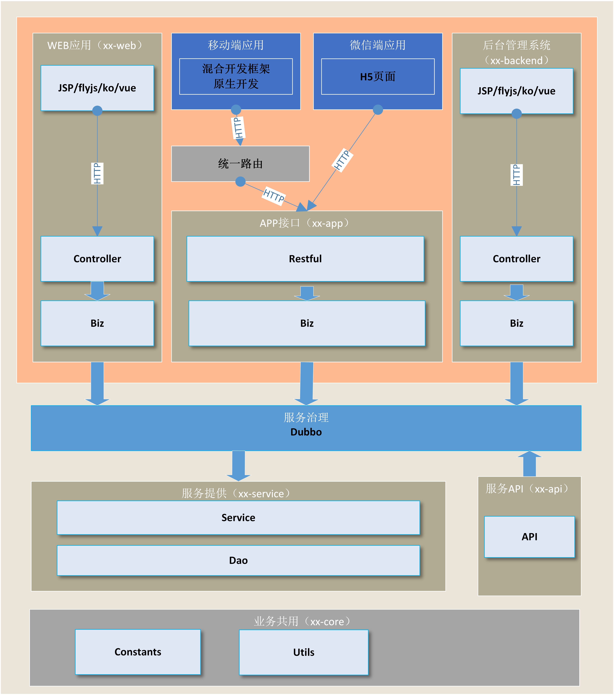

## 开发指南

### 设计思想

* 一个大型的分布式系统一般会包含多个应用，各个应用包含多端展现（`移动端、wx端、web门户、后台管理`），而且应用之间往往还存在共同的业务（`上传、评论、支付、搜索`），应用之间还会存在调用关系（`旅游电商门户调用旅游资讯网业务`）。因此，为了使业务得到很好的复用，模块更加容易拓展和维护。
* 我们希望业务与应用分离，应用层只包含前端展现和路由接口，服务层来实现具体业务，以供多端应用在不同场景下使用，因此业务的接口需要具备通用性，可供多端多应用使用，这对各位的设计能力来讲是一个考验（易用性、通用性、易拓展易维护）。
* 服务层被共享使用，会带来一些其它的挑战，比如业务并发压力等，考虑到性能、伸缩性、可用性和与Spring结合使用的技术成本，我们选择阿里的开源服务框架dubbo来解决这些问题，由dubbo来提供服务治理功能，dubbo-api 提供接口，dubbo-service 提供业务服务。 `ps：对于dubbo框架不了解的同学可以学习 http://dubbo.wangxingrong.com/User+Guide-zh.htm`
* 这个时候有些同学不禁会疑惑，已经有Service业务层处理业务了，我们的biz层又是做什么的呢？ 
    + 聚合服务；我们有很多分布式服务（`上文提到的评论、支付等`），biz层的一个主要作用是把它们聚合起来，封装成一个与前端适配的接口
    + 数据的格式化处理，满足各端应用对数据不同的表现形式。
        > 举例：服务层有一个getUser的方法返回一个系统用户，其中有一个属性是gender`（性别）`，对于服务层来说，它只从语义上定义：1-男，2-女，0-未知。 而接口服务同时给多端应用展现，不同展现层的要求有所不同（app端显示 1-帅哥，2-美女；web门户应用显示1-男性，2-女性），就会出现问题了。 再者，回到设计层面上分析，从职责单一原则来看，服务层只负责业务数据（返回 1，2，0）与具体的展现形式无关，因此它返回的数据不应该出现与展现形式的耦合。
    
### 程序分层

* *Controller/Restful*（接口路由层）：接受前台请求和参数并返回，前台参数校验。
* *Biz*（聚合层）：调用各类业务服务（*Service*），聚合数据并格式化。
* *Service*（业务层）：调用各个数据库表数据（*Dao*），实现业务逻辑。
* *Dao*（持久层）：调用*SQL*，操作数据库。

### 开发规范
* 安装**Alibaba Java Code Guidelines**插件，检查代码规范性，严格注意：
    + 不允许任何魔法值（`即硬编码`）直接出现在代码中。
    + 方法注释要清晰正确，包含`param`和`return`。
* 命名规范：
    + Java类名、局域变量、类变量名、方法名采用标准驼峰命名，切勿出现单词拼写错误。
    + 常量命名由大写字母与下划线组成，禁止简写。
    + 数据库表名、字段名由小写字母加下划线组成。最多长度30个字母，允许适当使用简写。
    + 除`java`文件以外的其他类型文件，包括`xml、jsp、properties`等由小写字母和横线组成。
* *SVN* 使用规范：
    + **切记**避免提交不该提交的代码，例如构建生成的文件（`.iml`、`.classpath`等）。
    + 提交SVN必须写备注，清晰规范并能正确描述所提交内容。
    + 版本迭代完成之后将稳定版代码打Tags。
* *maven* 使用规范：
    + parent 项目`pom.xml`中使用`dependencyManagement`预定义整个项目所需的内部、外部依赖和配置信息，当项目升级时及时添加、更改。
    + 属性值统一定义在`properties`中，便于集中维护。
    + 开发中的版本号定义为SNAPSHOT，完成后升级为稳定版，下一阶段迭代开发时升级版本号。 `注意：项目交付时不能使用SNAPSHOT版本的jar包（特别是api.jar），以免后续的修改对已有上线项目造成影响。`
* *GET/POST* 请求使用规范：
    + 搜索、查询、详情、显示等获取行为使用`get`。
    + 提交、更新、删除等操作行为使用`post`。
* 数据模型定义规范：
    + api接口层的数据模型，它是对外提供服务接口，为保护数据库数据结构，数据模型不可直接使用数据库映射的实体。
    + api接口数据模型的作用是应用层与服务层之间传递数据的对象，命名应以Dto（`Data Transfer Object`）结尾。
    + 由于dubbo协议通常传输数据是二进制数据，也就是说你传递对象时对象将会被序列化，所以Dto对象一定要**实现Serializable接口**（`可安装GenerateSerialVersionUID插件自动生成serialVersionUID`），否则dubbo消费者调用会出错。
    + 应用层的数据模型，它的作用是把某个指定页面的所有数据封装起来，因此把它定义为视图对象，命名应以Vo（`View Object`）结尾。
* 异常处理规范：
    + 框架已对常见的Http异常进行了识别、处理和封装，无需再重复处理。
    + 及时抛出业务产生的异常，即 **BusinessException**。
    + 对可预见的异常以及RPC异常进行日志记录，以便于线上问题追踪。
* 参数合法性检查规范：
    + 在应用控制层进行前端入参合法性校验，避免异常参数流向下一层造成业务异常，甚至**事务无法回滚**问题。
    + dubbo-api是提供给自身应用以及其他业务使用的对外接口，考虑到安全性和通用性，需在接口处（`已融合Hibernate Validate框架，使用注解即可`）做参数校验。

